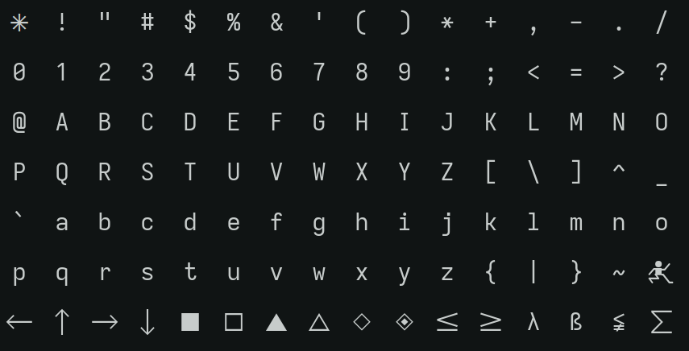

# Ioshelfka

[Iosevka]: https://typeof.net/Iosevka

Home-baked [Iosevka] builds created for personal use.

| Preview                              |
| ------------------------------------ |
|  |

## Building

4 packages are provided by the flake.

- Ioshelfka Mono
- Ioshelfka Term
- Ioshelfka Mono Nerdfont
- Ioshelfka Term Nerdfont

```bash
$ nix build github:notashelf/ioshelfka#ioshelfka-mono -Lv
```

## Credits

[@viperML]: https://github.com/viperML
[custom Iosevka build]: https://github.com/viperML/iosevka/
[build guide]: https://github.com/be5invis/Iosevka/blob/main/doc/custom-build.md

The build process is partially inspired by [@viperML]'s [custom Iosevka build].

Additionally, the [Iosevka customizer](https://typeof.net/Iosevka/customizer)
and the [build guide] found in the Iosevka repository have been very valuable
resources. Thank you!
